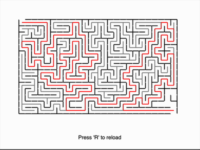

# Maze Generator & Solver
#### A [Boot.Dev](https://boot.dev "boot.dev") guided project
This Python implementation generates random mazes using **randomized depth-first search ([DFS](https://en.wikipedia.org/wiki/Depth-first_search "Wikipedia - Depth First Search"))** and solves them using recursive depth-first search with backtracking.


## Features

|                       |                          |
|-----------------------|--------------------------|
| 🌀 **Maze Generation**  | Uses recursive backtracking (DFS) with random neighbor selection to carve unique paths. |
| 🔍 **Maze Solving**      | Solves the maze using DFS with visual backtracking to show the search process in action. |
| 🖥️ **Live Visualization** | Built with Tkinter to display real-time maze creation and solving animations. |
| ⏱️ **Speed Control**      | Adjustable animation speed using sleep timers (default: `0.002s`) for fine-tuned pacing. |
| 🚪 **Defined Entry/Exit** | Automatically creates clear entrance and exit points with opened walls. |

## Getting Started
### Installation
#### Requirements
- [Python 3.13.3](https://www.python.org/downloads/)
- [Tkinter](https://docs.python.org/3/library/tkinter.html) (usually included with standard Python installations)
#### macOS (Homebrew)
```bash
brew install python-tk@3.13 tcl-tk 
```

#### Linux (Debian/Ubuntu)
```bash
sudo apt-get install python3-tk 
```
#### Verify Installation

``` bash
python -c "import tkinter; tkinter._test()"
```

## Usage
#### To run the program

``` bash
python3 src/main.py
```
#### To run the tests
``` bash
python3 src/tests.py
```
## Technical Implementation
### Generation (`_break_walls_r`)
1. Starts from (0,0) cell
2. Randomly selects unvisited neighbors
3. Breaks walls between current cell and selected neighbor
4. Recursively continues until all cells visited
### Solving (`_solve_r`)
1. Begins at entrance (0,0)
2. Uses recursive DFS with backtracking
3. Marks visited cells to prevent loops
4. Draws movement (red) and backtracking (grey) paths
5. Stops when exit cell is found
### Key Structures
- 2D list of `Cell` objects
- Walls stored as boolean flags in each cell
- Visited state tracking during solving
## Customization Options
- Adjustable grid size (`num_rows`, `num_cols`)
- Configurable cell dimensions (`cell_size_x`, `cell_size_y`)
- Optional random seed for reproducible mazes
